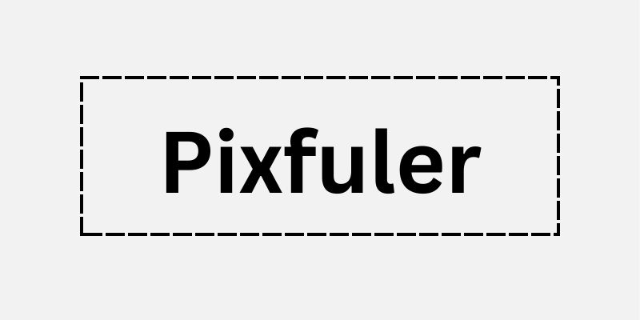

<p align="center">
  
</p>

[Add short description (one sentance)]: #
<p align="center">
  Sample Photo Editor
</p>

## 📂Table of Contents
- [📂Table of Contents](#table-of-contents)
- [📋Project Description](#project-description)
- [⛏️Built Using](#️built-using)
- [🏁 Getting Started](#-getting-started)
  - [🎫Prerequisites](#prerequisites)
- [📝Usage](#usage)
- [✍Authors](#authors)
- [💳License](#license)
- [🏅Acknowledgments](#acknowledgments)

## 📋Project Description
<p>
Sample photo editor builds using Python with OpenCV, Tkinter, and Pillow libraries. That allows the user to upload an image and modify it with functions provided by OpenCV (resize, rotate, flip, crop, blur) and save it. 
<br>
<br>
Note: The project does not demonstrate my design skills.
</p>


## ⛏️Built Using
- [Python](https://www.python.org/): Programming language


## 🏁 Getting Started


### 🎫Prerequisites
You need the following libraries:
- [OpenCV](https://opencv.org/)
```
pip install opencv-python
```
- [Tkinter](https://docs.python.org/3/library/tkinter.html)
```
pip install tk
```
- [Pillow](https://pypi.org/project/Pillow/)
```
pip install Pillow

```

## 📝Usage
Just run "app.py" file, after pulling the project.

## ✍Authors
- [@Mohammed-Dhabaab](github.com/mohammed-dhabaab)

## 💳License
- [MIT](https://opensource.org/license/mit/)

## 🏅Acknowledgments
- [EVC](evc.sa)
- [Eng.Ibrahem Saber](https://www.linkedin.com/in/ibrahem-elnawasany/)